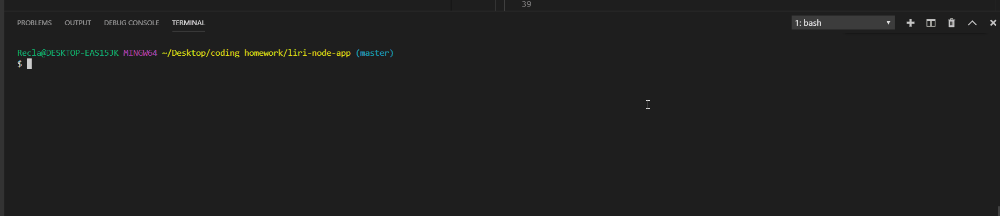

# Liri-node-app

What does it do?

It can do whatever you want, as long as you want to search for a song, movie, find a band on tour, or pull simple commands from a text file.

This project incorporates several NPM packages including:
    **1)** node-spotify-api, 
    **2)** Omdb,  
    **3)** dotenv, 
    **4)** moment, 
    **5)** axios, 
    **6)** cli-tables, and 
    **7)** fs, 

## How to use it:

### To find a song on spotify:
    On the command line:  
        node liri.js spotify-this-song  
            followed by your song of choice.  
            This will create a table with the Artist's Name, Song Name, Album Name, and a preview URL link. 
            
     

### To find a movie on omdb:
    On the command line:  
        node liri.js movie-this  
            followed by your movie of choice. 
            this will create a table with the movie title, year the movie was made, the IMDB rating, the Country the movie was produced in, the Lnaguages the movie can be heard in, the basic plot of the movie, and the actors in the movie. 

 

### To find a band on tour:
    On the command line:
        node liri.js concert-this
            followed by your band of choice.
            This will create a table with the venue name, city and country, as well as the date and time of the show.

 

### To do what the text file says:
    On the command line:
        node liri.js do-what-it-says
            This will load values from the text file random.txt and run the corresponding function with preloaded values.

 
